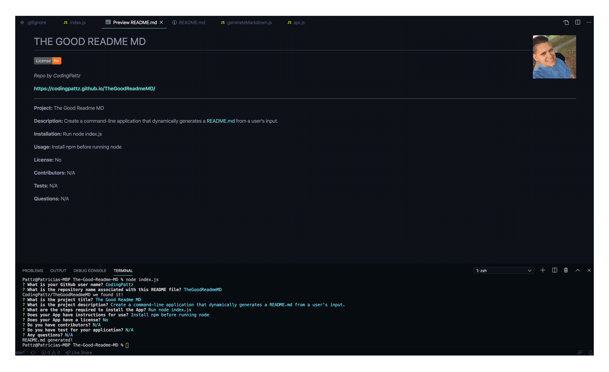

# THE GOOD README MD

_Repo by CodingPattz_

__https://codingpattz.github.io/TheGoodReadmeMD/__

---

__Project:__
The Good Readme MD

__Description:__
Create a command-line application that dynamically generates a README.md from a user's input.

__Installation:__
Run node index.js

__Usage:__
Install npm before running node

__License:__
No

__Contributors:__
N/A

__Tests:__
N/A

__Questions:__
N/A

[The Good Readme MD Demo](https://youtu.be/KX0i4IV-zHU)

  

